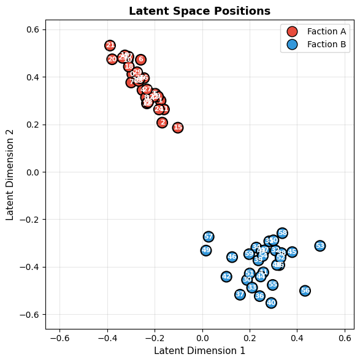
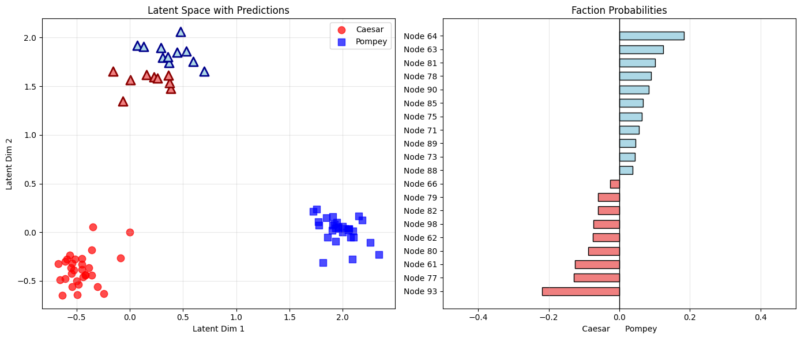

# Probabilistic Modeling of Political Networks  
## Overview
This repository contains my **final project** and **lab work** for the Probabilistic Programming course.  
The project applies **Bayesian modeling** and **latent space methods** to political interaction networks, uncovering hidden social structure, leadership, negotiation roles, and faction alignment under uncertainty.

**Tools:** Python, PyMC, ArviZ, NetworkX, NumPy/SciPy, Matplotlib, Pandas

---

## Exercise 1 – Influence in a Bipartisan Network

**Data**
- Nodes represent politicians
- Edges represent message counts
- Two known factions (A and B)
- Count data modeled using a Poisson likelihood

**Model: Latent Distance Model**

- Interaction rate between nodes *i* and *j*:
```math
\lambda_{ij} = \exp\left(\beta_0 - \lVert U_i - U_j \rVert\right)
```
- Observed messages:
```math
Y_{ij} \approx Poisson(\lambda_{ij})
```

Where:
- U_i is the 2D latent position of node *i*
- Smaller latent distance implies stronger interaction

**Findings**
- Latent space cleanly separates the two factions
- **Faction A:** centralized, hierarchical structure  
  - Node 23 is most influential (≈84% posterior probability)
- **Faction B:** decentralized, competitive leadership  
  - Nodes 39 and 41 are nearly tied
- Most influential nodes are not necessarily the best negotiators

  

**Model checks**
- Good MCMC convergence (R-hat ≈ 1)
- Posterior predictive checks show good fit

| Parameter | Mean  | SD    | HDI 3% | HDI 97% | MCSE Mean | MCSE SD | ESS (Bulk) | ESS (Tail) | R-hat |
|----------|-------|-------|--------|---------|-----------|---------|------------|------------|-------|
| Intercept | 3.625 | 0.022 | 3.583  | 3.667   | 0.004     | 0.000   | 35         | 569        | 1.07  |
| Sigma_u   | 2.098 | 0.136 | 1.855  | 2.362   | 0.002     | 0.001   | 6620       | 7034       | 1.00  |


---

## Exercise 2 – Splitting the Triumvirate

**Data**
- Three factions: Caesar, Pompey, Crassus
- Crassus members have unknown future allegiance
- Meeting counts exhibit strong overdispersion

**Model: Joint Latent Space + Classifier**
- Anchored latent space:
  - Caesar fixed at (0, 0)
  - Pompey fixed at (2, 0)
- Meetings modeled with a **Negative Binomial** likelihood
- Logistic classifier predicts faction membership from latent positions
- Latent positions and faction probabilities inferred jointly

**Findings**
- Clear latent separation between Caesar and Pompey
- 70% accuracy on known Crassus labels
- Probabilistic predictions capture genuine ambiguity
- Simulations suggest Caesar is slightly more likely to recruit more Crassus members
- Identifies the most undecided politicians (probabilities near 0.5)
  
  
